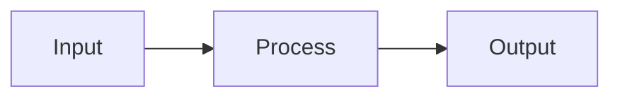
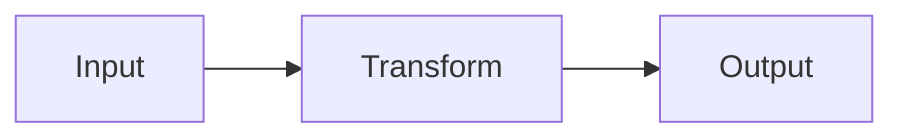
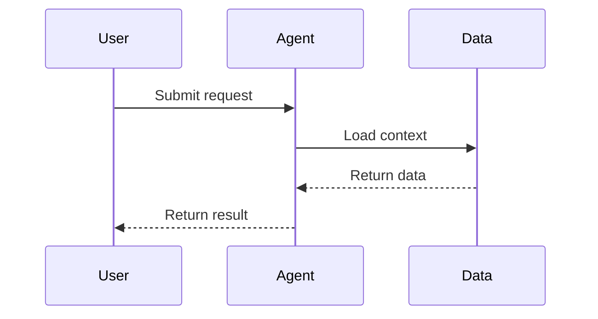
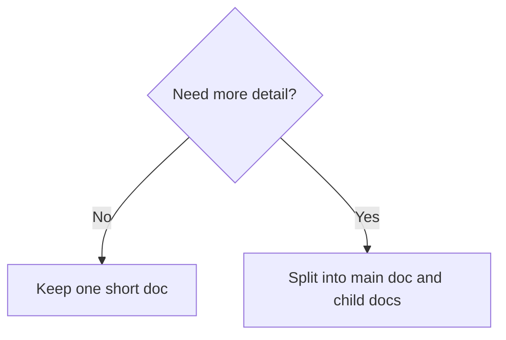

# Document Structure Patterns

## Standard Section Formula

Use this formula for each main-document section:

1. Say what we are doing.
2. Say why this matters.
3. Say what is key.
4. Show one support artifact if useful.
5. Add `See:` and the child link.

Example:

```markdown
## 3. What Is Key

The main risk is not missing more inputs. The main risk is failing to make the four core objects usable.

| Object | Why It Matters |
| --- | --- |
| market_daily | This is the fact base for every research judgment. |
| event_log | This turns news into research-ready events. |

See:
[System Design](https://...)
```

## Split Decision Checklist

Split when the source document mixes two or more of these:

- background or cognition
- design
- output specification
- execution planning
- schemas, examples, code, or other assets

Do not split only because a document is slightly long.
Split when readability drops because the document is solving too many different problems.

## Main Document Template

```markdown
# 1. What We Are Doing

State the goal, scope, and selection reason directly.

| Dimension | Conclusion |
| --- | --- |
| ... | ... |

See:
[Child Doc A](https://...)

# 2. Why We Are Doing It

State the reason, decision rule, and minimum path directly.



See:
[Child Doc B](https://...)
```

## Diagram Templates

Use `mermaid` when the document needs a real diagram.

Flow:



Sequence:



Decision:



## Child Document Template

Use one information type per child document.

Suggested openings:

- `cognition`: explain the domain object, its position, and why it matters
- `design`: explain the system path, core objects, and design constraints
- `output-spec`: explain what the output must answer and how it should be structured
- `execution`: explain priorities, owners, next steps, and completion marks
- `assets`: explain fields, samples, reference records, and code snippets

## Anti-Patterns

Avoid these:

- "this section introduces..."
- "the value of this document is..."
- "for more information please see..."
- giant main docs with no artifacts
- child docs that still mix multiple information types
- plain code blocks or ASCII layouts used as fake diagrams
- long bullet chains where a `mermaid` flowchart would be clearer

Prefer direct content summaries instead.
